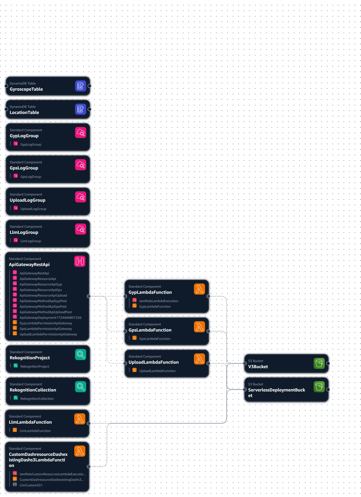

# Desafio Técnico V3

## 💻 O Problema

Um dos nossos clientes ainda não consegue comprar o equipamento para colocar nos veículos de sua frota, mas ele quer muito utilizar a nossa solução.

Por isso, vamos fazer um MVP bastante simples para testar se, o celular do motorista poderia ser utilizado como o dispositivo de obtenção das informações.

> Parece fazer sentido certo? Ele possui vários mecanismos parecidos com o equipamento que oferecemos!

Sua missão ajudar na criação deste MVP para que possamos testar as frotas deste cliente.

Essa versão do produto será bastante simplificada. Queremos apenas criar as estruturas para obter algumas informações do seu dispositivo (Android) e armazená-la em um Banco de Dados.

Essas informações, depois de armazenadas devem estar disponíveis através de uma API para que este cliente integre com um Front-end já existente!

### Quais serão as informações que deverão ser coletadas?

1. **Dados de Giroscópio** - Estes dados devem retornar 3 valores (`x`, `y`, `z`). E devem ser armazenados juntamente com o `TIMESTAMP` do momento em que foi coletado;
2. **Dados de GPS** - Estes dados devem retornar 2 valores (`latitude` , `longitude`). E também devem ser armazenados juntamente com o `TIMESTAMP` do momento em que foram coletados;
3. **Uma foto** - Obter uma foto de uma das câmeras do dispositivo e enviá-la também junto com o `TIMESTAMP` em que foi coletada;

**🚨 É importante que se envie junto à essas informações um campo adicional, contendo uma identificação única do dispositivo, que pode ser seu endereço MAC.**

---

### Estrutura do Projeto

O projeto foi construído utilizando a linguagem `Go` e o `Serverless Framework`.

Os padrões de projeto utilizados foram baseados no `Clean Architecture`, `SOLID` e `DDD`.

- **`/functions`**: Contém as funções Lambda.

      |── functions.yml
          ├── gps
          │   └── route.go
          ├── gyroscope
          │   └── route.go
          ├── llm
          │   └── route.go
          └── photo
              └── route.go

- **`/internal`**: Contém o código da aplicação.

        internal 

- **`/adapter`**: Contém os adaptadores para conversão de dados, como datas, UUIDs, etc, mantendo a aplicação independente de bibliotecas externas.

      ├── date
      │   ├── adapter.go
      │   └── adapter_test.go
      ├── multipart
      │   ├── adapter.go
      │   ├── adapter_test.go
      │   └── form
      │       ├── form.go
      │       └── form_test.go
      └── uuid
          ├── adapter.go
          └── adapter_test.go


- **`/domain`**: Contém as entidades da aplicação.

      ├── domain
      │   ├── coordinate.go
      │   ├── faces.go
      |   ├── gps.go
      │   ├── gyroscope.go
      │   └── photo.go

- **`/infra`**: Contém a infraestrutura da aplicação, como banco de dados, S3, Rekognition, etc.

      ├── infra 
      │   ├── database.go
      │   ├── dynamodb.go
      │   ├── http.go
      │   ├── logger.go
      │   ├── rekognition.go
      │   └── s3.go

- **`/repository`**: Contém os repositórios para acesso ao banco de dados.

      ├── repository 
      │   ├── gps
      │   │   ├── create.go
      │   │   └── repository.go
      │   ├── gyroscope
      │   │   ├── create.go
      │   │   └── repository.go
      │   ├── photo
      │   │   ├── create.go
      │   │   ├── find.go
      │   │   └── repository.go
      │   ├── rekognition
      │   │   ├── create.go
      │   │   ├── find.go
      │   │   └── repository.go
      │   └── s3
      │       ├── repository.go
      │       └── upload.go

- **`/route`**: Contém as rotas da aplicação.

      ├── route
      │   ├── gps
      │   │   └── route.go
      │   ├── gyroscope
      │   │   └── route.go
      │   ├── llm
      │   │   └── route.go
      │   └── upload
      │       └── route.go

- **`/service`**: Contém os serviços da aplicação.

      ├── service
      │   ├── gps
      │   │   ├── create.go
      │   │   └── service.go
      │   ├── gyroscope
      │   │   ├── create.go
      │   │   └── service.go
      │   ├── photo
      │   │   ├── create.go
      │   │   ├── find.go
      │   │   └── service.go
      │   └── rekognition
      │       ├── create.go
      │       ├── find.go
      │       └── service.go

- **`/shared`**: Contém o código compartilhado.

      ├── shared
      │   ├── database.go
      │   └── http.go

- **`/usecase`**: Contém os casos de uso da aplicação.

      ├── gps
      │   ├── create
      │   │   ├── create.go
      │   │   └── create_test.go
      │   └── usecase.go
      ├── gyroscope
      │   ├── create
      │   │   ├── create.go
      │   │   └── create_test.go
      │   └── usecase.go
      ├── photo
      │   ├── create
      │   │   ├── create.go
      │   │   └── create_test.go
      │   ├── find
      │   │   ├── find.go
      │   │   └── find_test.go
      │   └── usecase.go
      └── rekognition
          ├── create
          │   ├── create.go
          │   └── create_test.go
          ├── search
          │   ├── search.go
          │   └── search_test.go
          └── usecase.go

---

# Arquitetura 

Este repositório contém a infraestrutura e código para um sistema de processamento de dados utilizando diversos serviços da AWS, incluindo Lambda, DynamoDB, API Gateway, S3 e Rekognition.

## Visão Geral

A arquitetura é composta pelos seguintes componentes principais:

### Tabelas DynamoDB

- **GyroscopeTable**: Armazena dados de giroscópio.
- **LocationTable**: Armazena dados de localização.

### Grupos de Log (CloudWatch)

- **GypLogGroup**: Logs para eventos da função `GypLambdaFunction`.
- **GpsLogGroup**: Logs para eventos da função `GpsLambdaFunction`.
- **PhotoLogGroup**: Logs para eventos da função `PhotoLambdaFunction`.
- **LmLogGroup**: Logs para eventos da função `LmLambdaFunction`.


## IAM & Policies

### Policies
- **V3BucketPolicy**: Permissão para o bucket S3 acessar o artefacto de deployment serverless.


#### IAM
- **IamRoleLambdaExecution**: Permissão para as funções Lambda acessarem os serviços da AWS.
- **GypLambdaPermissionApiGateway**: Permissão para a função `GypLambdaFunction` acessar o API Gateway.
- **ServerlessDeploymentBucketPolicy**: Permissão para o bucket S3 acessar o artefacto de deployment serverless.
- **GpsLambdaPermissionApiGateway**: Permissão para a função `GpsLambdaFunction` acessar o API Gateway.
- **GpsLambdaFunctionRole**: Permissão para a função `GpsLambdaFunction` acessar o DynamoDB.
- **LlmLambdaFunctionRole**: Permissão para a função `LmLambdaFunction` acessar o Rekognition.
- **PhotoLambdaFunctionRole**: Permissão para a função `PhotoLambdaFunction` acessar o S3.
- **PhotoLambdaPermissionApiGateway**: Permissão para a função `PhotoLambdaFunction` acessar o API Gateway.
- ***IamRoleCustomResourcesLambdaExecution**: Permissão para a função `CustomResourcesLambda` acessar os serviços da AWS.

    
### API Gateway

**ApiGatewayRestApi**: Exposição das funções Lambda como endpoints HTTP.

### Funções Lambda

- **GypLambdaFunction**: Processa dados de giroscópio.
- **GpsLambdaFunction**: Processa dados de GPS.
- **UploadLambdaFunction**: Lida com upload de dados.
- **LmLambdaFunction**: Processa um novo treino de modelo de reconhecimento de imagem a cada ‘upload’ de foto.

### Amazon Rekognition

- **RekognitionProject**: Projeto para análise de imagens.
- **RekognitionCollection**: Coleção de imagens utilizada para comparação e análise.

### Buckets S3

- **V3Bucket**: armazena dados processados pelas funções Lambda.
- **ServerlessDeploymentBucket**: Armazena artefacts de deployment serverless.


### Diagrama de Arquitetura




---

## Nível 1


`POST /telemetry/gyroscope` - **GypLambdaFunction**

* O valor de `x`, `y` e `z` deve ser um número decimal, com valor padrão de 0.

  ```bash
  curl --location --request POST 'https://v79gnfzt1h.execute-api.us-east-1.amazonaws.com/dev/telemetry/gyroscope' \
  --header 'Content-Type: application/json' \
  --data-raw '{
      "x": 223142,
      "y": 21414,
      "z": 14
    }'
  ```

  ```json
  {
    "x": 223142,
    "y": 21414,
    "z": 14
  }
  ```


---

`POST /telemetry/gps` - **GpsLambdaFunction**

* O valor de `latitude` e `longitude` deve ser um número decimal, com valor padrão de 0.

  ```bash
  curl --location --request POST 'https://v79gnfzt1h.execute-api.us-east-1.amazonaws.com/dev/telemetry/gps' \
  --header 'Content-Type: application/json' \
  --data-raw '{
  "latitude": -81.214124,
  "longitude": -46.614124333
  }'
  ```

  ```json
  {
    "latitude": -81.214124,
    "longitude": -46.614124333
  }
  ```

---

`POST /telemetry/photo` - **PhotoLambdaFunction**

* A foto deve ser enviada como um arquivo multipart/form-data com o campo `file`.

    ```bash
    curl --location --request POST 'https://v79gnfzt1h.execute-api.us-east-1.amazonaws.com/dev/telemetry/photo' \
  --form 'file=@"C:\\Users\\kevenmiano\\Área de Trabalho\\assets\\albert-dera-ILip77SbmOE-unsplash.jpg"'
    ```

---

## Nível 2

Para armazenar os dados, foi utilizado o DynamoDB, pois é um banco gerenciado e escalável, sendo ideal para armazenar dados de telemetria.

- **GyroscopeTable**: Armazena dados de giroscópio.

    - `X` - Valor de giroscópio no eixo x.
    - `Y` - Valor de giroscópio no eixo y.
    - `Z` - Valor de giroscópio no eixo z.
    - `Timestamp` - Data e hora da coleta.
    - `DeviceID` - Identificação única do dispositivo


- **LocationTable**: Armazena dados de localização.

    - `Latitude` - Valor de latitude.
    - `Longitude` - Valor de longitude.
    - `Timestamp` - Data e hora da coleta.
    - `DeviceID` - Identificação única do dispositivo
    
---

## Nível 3

Foi utilizado o pacote `mockery` para `mock` de interfaces, `testing` para testes unitários e `gofakeit` para geração de dados falsos.

### Testes Unitários 

**CreateGpsUseCase**: Cria um dado de GPS.

  - **TestCreateGpsUseCase_Execute**: testa a criação de um novo dado de GPS.
  - **TestInvalidLatitude_Error**: testa a criação de um novo dado de GPS com latitude inválida.
  - **TestInvalidLongitude_Error**: Testa a criação de um novo dado de GPS com longitude inválida.\
  - **TestInvalidDeviceID_Error**: testa a criação de um novo dado de GPS com DeviceID inválido.
  - **TestInvalidTimestamp_Error**: testa a criação de um novo dado de GPS com Timestamp inválido.


**CreateGyroscopeUseCase**: Cria um dado de giroscópio.

  - **TestCreateGyroscopeUseCase_Execute**: testa a criação de um novo dado de giroscópio.
  - **TestInvalidDeviceID_Error**: testa a criação de um novo dado de giroscópio com DeviceID inválido.
  - **TestInvalidTimestamp_Error**: testa a criação de um novo dado de giroscópio com Timestamp inválido.


**CreatePhotoUseCase**: Cria um dado de foto.

  - **TestCreatePhotoUseCase_Execute**: testa a criação de um novo dado de foto.
  - **TestCreatePhotoUseCase_FileNameRequired_Error**: testa a criação de um novo dado de foto sem o campo `filename`.
  - **TestCreatePhotoUseCase_ContentRequired_Error**: testa a criação de um novo dado de foto sem o campo `content`.
  - **TestCreatePhotoUseCase_ContentTypeInvalid_Error**: testa a criação de um novo dado de foto com o campo `content` inválido.

**FindPhotoUseCase**: Encontra um dado de foto.

  - **TestFindPhotoUseCase_Execute**: testa a busca de um dado de foto.
  - **TestFindPhotoUseCase_FileNameRequired_Error**: testa a busca de um dado de foto sem o campo `filename`.
  - **TestFindPhotoUseCase_ContentRequired_Error**: testa a busca de um dado de foto sem o campo `content`.
  - **TestFindPhotoUseCase_ContentTypeInvalid_Error**: testa a busca de um dado de foto com o campo `content` inválido.
  - **TestFindRecognizePhotoUseCase_Execute**: testa a busca de um dado de foto com reconhecimento de imagem.\
  - **TestFindPhotoUseCase_NotFound_Error**: testa a busca de um dado de foto não encontrado.
  - **TestCreateJpgPhotoUseCase_Execute**: testa a criação de um novo dado de foto com extensão `jpg`.
  - **TestCreateJpegPhotoUseCase_Execute**: testa a criação de um novo dado de foto com extensão `jpeg`.
  - **TestCreatePngPhotoUseCase_Execute**: testa a criação de um novo dado de foto com extensão `png`.

**CreateRekognitionUseCase**: cria um dado de reconhecimento de imagem.

  - **TestNewCreateIndexFaceUseCase_Execute**: testa a criação de um novo dado de reconhecimento de imagem.
  - **TestNewCreateIndexFaceUseCase_Execute_Error**: testa a criação de um novo dado de reconhecimento de imagem com erro.


**SearchRekognitionUseCase**: pesquisa um dado de reconhecimento de imagem.

  - **TestNewSearchFaceUseCase_Execute**: testa a pesquisa de um dado de reconhecimento de imagem.
  - **TestNewSearchFaceUseCase_Execute_Error**: testa a pesquisa de um dado de reconhecimento de imagem com erro.

### Executar Testes


```bash
go test -count=1 ./internal/usecase/...
```
---

## Nível 4

Foi utilizado o `Serverless Framework` para gerir a infraestrutura como código, facilitando a implantação e remoção da infraestrutura.

Por padrão, o `Serverless Framework` utiliza o `CloudFormation` para gerir a infraestrutura.

**Observações**:

- `multipart/form-data` não é suportado nativamente para o ambiente local, utilizando o `serverless-offline`, utilize o ambiente produtivo para testar o ‘upload’ de fotos.


Para preparar o ambiente, é necessário instalar o `Node.js v20.12.2` e o `Serverless Framework`.

- **Node.js**: Instalar o Node.js.
    ```bash
    npm install -g serverless
    ```
- **Serverless Framework**: Instalar o Serverless Framework.
    ```bash
    npm install
    ```

Para hospedar a aplicação localmente, execute os seguintes comandos:
  
Crie um nov utilizador no IAM com as seguintes permissões:

 - ***ServerlessFrameworkCli***: Permissão para o Serverless Framework.
    

  ```json
        {
          "Version": "2012-10-17",
          "Statement": [
            {
              "Effect": "Allow",
              "Action": [
              "apigateway:PUT",
              "apigateway:POST",
              "apigateway:PATCH",
              "apigateway:DELETE",
              "apigateway:GET"
              ],
              "Resource": "*"
            },
            {
              "Effect": "Allow",
              "Action": "apigateway:PATCH",
              "Resource": "*"
            },
            {
              "Sid": "DelegateToCloudFormationRole",
              "Effect": "Allow",
              "Action": "iam:PassRole",
              "Resource": "arn:aws:iam::522737137457:role/CloudFormationExecutionRole"
            },
            {
              "Sid": "ValidateCloudFormation",
              "Effect": "Allow",
              "Action": "cloudformation:ValidateTemplate",
              "Resource": "*"
            },
            {
              "Sid": "ExecuteCloudFormation",
              "Effect": "Allow",
              "Action": [
              "cloudformation:CreateChangeSet",
              "cloudformation:CreateStack",
              "cloudformation:DeleteChangeSet",
              "cloudformation:DeleteStack",
              "cloudformation:DescribeChangeSet",
              "cloudformation:DescribeStackEvents",
              "cloudformation:DescribeStackResource",
              "cloudformation:DescribeStackResources",
              "cloudformation:DescribeStacks",
              "cloudformation:ExecuteChangeSet",
              "cloudformation:ListStackResources",
              "cloudformation:SetStackPolicy",
              "cloudformation:UpdateStack",
              "cloudformation:UpdateTerminationProtection",
              "cloudformation:GetTemplate"
              ],
              "Resource": "arn:aws:cloudformation:us-east-1:522737137457:stack/aws-golang-api-dev/*"
            },
            {
              "Sid": "ReadLambda",
              "Effect": "Allow",
              "Action": [
              "lambda:Get*",
              "lambda:List*"
              ],
              "Resource": "*"
            },
            {
              "Sid": "ManageSlsDeploymentBucket",
              "Effect": "Allow",
              "Action": [
              "s3:CreateBucket",
              "s3:DeleteBucket",
              "s3:ListBucket",
              "s3:PutObject",
              "s3:GetObject",
              "s3:DeleteObject",
              "s3:GetBucketPolicy",
              "s3:PutBucketPolicy",
              "s3:DeleteBucketPolicy",
              "s3:PutBucketAcl",
              "s3:GetEncryptionConfiguration",
              "s3:PutEncryptionConfiguration"
              ],
              "Resource": "arn:aws:s3:::aws-golang-api-dev-serverlessdeploymentbucket-gqzjmyfmbj4t/serverless/aws-golang-api/*"
            },
            {
              "Sid": "ListS3",
              "Effect": "Allow",
              "Action": "s3:List*",
              "Resource": "*"
            }
          ]
        }
```
  - ***S3FullAccess***: Permissão para o S3, selecione a política `AmazonS3FullAccess`


Configure o usuário na `AWS CLI`:
```bash
aws configure
```
---

  - **Definir variáveis de ambiente**: Definir as variáveis de ambiente no arquivo `.env`.
    
      ```bash
      cp .env.example .env
      ```
  - **Executar localmente**: Executar a aplicação localmente.
    
      ```bash
      npm run start
      ```

Para implantar a infraestrutura como código, execute os seguintes comandos:

  - **Runtime**: Defina a runtime no arquivo `serverless.yml`.
    
      ```yaml
      runtime: provided.al2
      ```

  - **Deploy**: Implantar a infraestrutura.
      ```bash
      npm run infra:deploy
      ```
    
  - **Remover**: Remover a infraestrutura.
    
      ```bash
      npm run infra:remove
      ```
Para implantar utilizando `docker` e `ssm`, execute os seguintes comandos:
  

  - **Serverless Framework**: Defina a variável de ambiente `ENV` como `local`.
    
      ```bash
      export ENV=local
      ```
    

  - **Runtime**: Defina a runtime no arquivo `serverless.yml`.
    
      ```yaml
      runtime: go1.x
      ```

  - **Deploy**: Implantar a infraestrutura.
      ```bash
      npm run infra:deploy:docker
      ```
    
  - **Remover**: Remover a infraestrutura.
    
      ```bash
      npm run infra:remove:docker
      ```

---

## Nível 5

As fotos enviadas para a API são armazenadas no S3 e enviadas para o Rekognition para análise.

A análise de imagem é feita pelo Rekognition, que retorna informações sobre a imagem, como objetos detetados e confiança.

- **RekognitionProject**: Projeto para análise de imagens.
- **RekognitionCollection**: Coleção de imagens utilizada para comparação e análise.

A cada ‘upload’ de foto, um novo treino de modelo de reconhecimento de imagem é feito automaticamente, utilizando gatilhos do S3.

---

